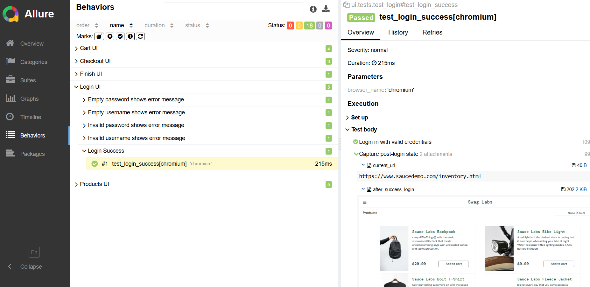
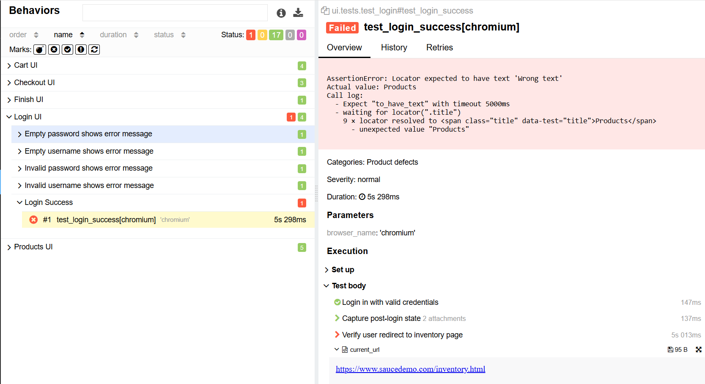

# QA Automation Project

A scalable QA automation framework for API testing built with Python, Pytest, and Requests, with Allure reporting integration.

---

## 🚀 Tech Stack

- Python
- Pytest
- Requests (API Testing)
- JSONSchema (Response Validation)
- Allure Report (Test Reporting)
- Playwright (UI Automation with POM)

---

## 📁 Project Structure

    api/
    ├── client/          # API client (request handling, auth, headers)
    ├── services/        # Service layer (business API abstraction)
    ├── schemas/         # Request & response schemas (JSONSchema)
    
    tests/
    ├── conftest.py      # API fixtures (api_client, auth, services)
    ├── auth/            # Authentication API tests
    ├── user/            # User API tests (CRUD)
    ├── product/         # Product API tests
    ├── cart/            # Cart API tests
    
    ui/
    ├── pages/           # Page Objects (Login, Inventory, Cart, Checkout)
    ├── tests/           # UI test cases
    ├── conftest.py      # UI fixtures (browser, page, login setup)
    
    common/
    ├── config/          # Environment configuration
    ├── logger/          # Logging setup
    ├── utils/           # Shared utilities (Allure helpers, validation tools)
    
    test_data/
    ├── api/             # API test payloads (JSON)
    ├── ui/              # UI test data (Python dicts)
    
    docs/
    ├── allure-report/   # Allure screenshots for README
    
    reports/             # Generated Allure results (gitignored)

---

## ✨ Features

- 🔹 API Client abstraction with reusable request methods  
- 🔹 Service layer for clean test logic separation  
- 🔹 JSON schema validation for response verification  
- 🔹 Positive & negative test coverage  
- 🔹 Allure reporting with:
  - Step-level execution
  - Feature / Story categorization
  - Request & response attachments
- 🔹 Centralized logging
- 🔹 UI automation with Playwright (POM design)
- 🔹 Automatic failure debugging (screenshot + URL)

## 🧠 Design Highlights

- Layered architecture across API and UI
  - API: client → service → test layer  
  - UI: page object (POM) → test layer  

- Separation of concerns for maintainability
  - API logic, UI interactions, and test assertions are decoupled  
  - Shared utilities (Allure, validation) centralized under common/  

- Reusable validation and reporting utilities
  - JSON schema validation for API responses  
  - Allure helpers for structured reporting and debugging  

- Strong debugging capabilities
  - Step-level execution tracking with Allure  
  - Automatic screenshot and URL capture on failure  
  - Request/response and UI state attachments  

- Scalable structure for API and UI automation
  - Easy to extend for new endpoints and UI pages  
  - Designed for end-to-end automation framework evolution  

---

## 📊 Allure Report (Test Execution & Debugging)

The project integrates Allure reporting to provide clear visibility into test execution and simplify debugging.

### 🔹 Test Overview

### 🔹 Test Steps

### 🔹 Request / Response Attachments

### 🔹 UI Debugging (Screenshot & URL)

### 🔹 Failure Debugging

---

### 🔍 Key Capabilities

- Step-level execution tracking  
- API request & response visibility  
- UI screenshot and current URL capture  
- Automatic failure debugging  

Enables fast root cause analysis without re-running tests.
UI tests include both manual and automatic screenshot capture strategies to ensure full visibility of test execution and failures

Run tests and generate report:

    pytest --alluredir=reports/ --clean-alluredir
    allure serve reports/

Report provides:

- Step-level execution visibility  
- Full request & response data for debugging  
- Structured test grouping (Feature / Story)  
- Clear failure diagnostics 

---

## ▶️ How to Run

Install dependencies:

    pip install -r requirements.txt

Run tests:

    pytest
