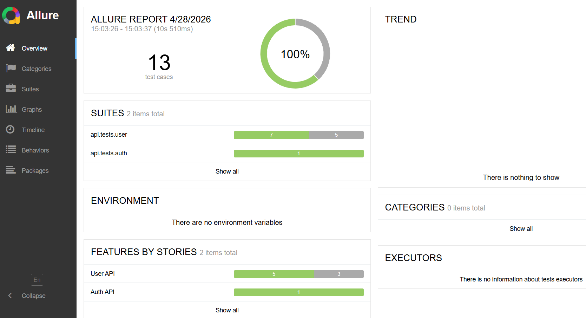
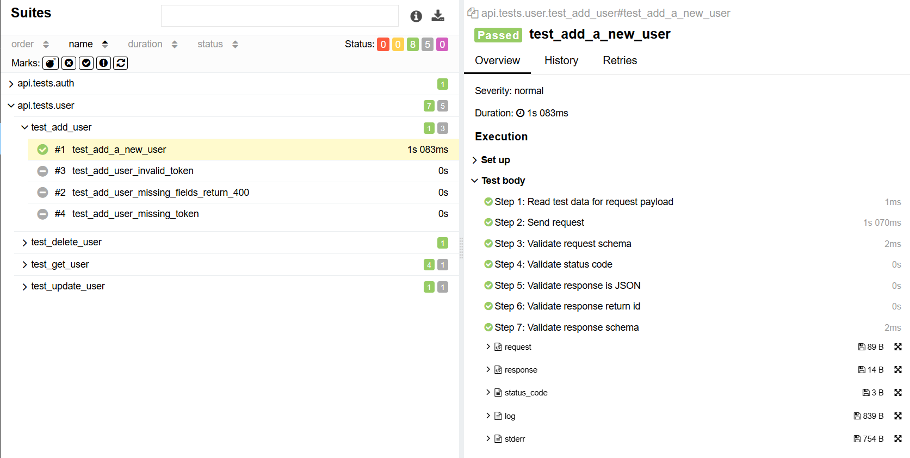
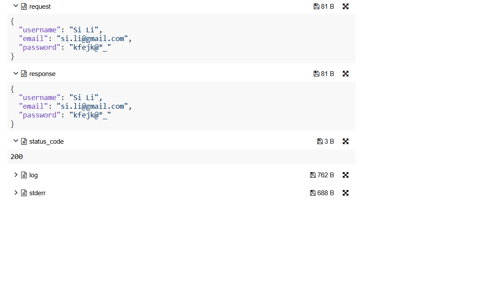

# QA Automation Project

A scalable QA automation framework for API testing built with Python, Pytest, and Requests, with Allure reporting integration.

---

## 🚀 Tech Stack

- Python
- Pytest
- Requests (API Testing)
- JSONSchema (Response Validation)
- Allure Report (Test Reporting)
- Playwright (UI Testing - in progress)

---

## 📁 Project Structure

    api/
    ├── client/      # API client (request handling, auth, headers)
    ├── services/    # Service layer (business API abstraction)
    ├── schemas/     # Request & response schemas
    ├── utils/       # Validation helpers

    common/
    ├── config/      # Environment config
    ├── logger/      # Logging setup
    ├── utils/       # Allure helpers, validation tools

    tests/
    ├── auth/        # Authentication tests
    ├── user/        # User API tests (CRUD)
    ├── product/     # Product API tests
    ├── cart/        # Cart API tests

    test_data/       # Test payloads (JSON)

---

## ✨ Features

- 🔹 API Client abstraction with reusable request methods  
- 🔹 Service layer for clean test logic separation  
- 🔹 JSON schema validation for response verification  
- 🔹 Positive & negative test coverage  
- 🔹 Allure reporting with:
  - Step-level execution
  - Feature / Story categorization
  - Request & response attachments
- 🔹 Centralized logging  

## 🧠 Design Highlights

- Layered architecture: API client, service layer, and test layer
- Separation of concerns for maintainability
- Reusable validation and reporting utilities
- Scalable structure for future UI automation

---

## 📊 Allure Report (Test Execution & Debugging)

### 🔹 Test Overview

### 🔹 Test Steps

### 🔹 Request / Response Attachments

Run tests and generate report:

    pytest --alluredir=reports/ --clean-alluredir
    allure serve reports/

Report provides:

- Step-level execution visibility  
- Full request & response data for debugging  
- Structured test grouping (Feature / Story)  
- Clear failure diagnostics 

---

## ▶️ How to Run

Install dependencies:

    pip install -r requirements.txt

Run tests:

    pytest